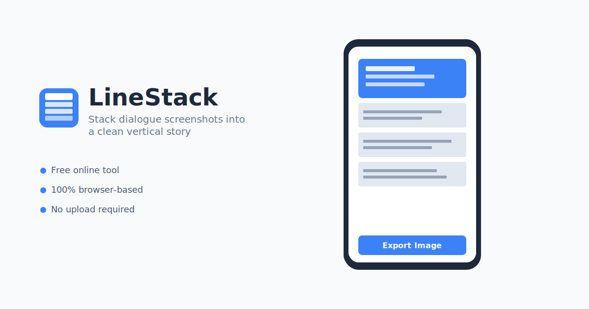

# LineStack

**Stack dialogue screenshots into a clean vertical story.**

A lightweight, browser-based tool for movie and TV show enthusiasts to combine dialogue screenshots into shareable vertical images.



## Features

- **Two Image Types**: Keyframe (full image) and Subtitle-only (cropped subtitles)
- **Drag & Drop**: Reorder images with touch-friendly drag and drop
- **Smart Cropping**: Visual crop editor with quick percentage input
- **Global Crop**: Apply crop settings to all subtitle images at once
- **Flexible Output**: Export at 720px or 1080px width
- **Keyframe Gaps**: Optional 8px gaps between keyframes
- **Watermark**: Add custom watermark text (up to 20 characters)
- **Risk Assessment**: Automatic height estimation and memory warnings
- **Auto Segmentation**: Splits long images to prevent memory issues
- **100% Local**: All processing happens in your browser - no uploads

## Tech Stack

- **React 18** + **TypeScript**
- **Vite** - Fast build tool
- **Tailwind CSS** - Utility-first styling
- **@dnd-kit** - Drag and drop
- **Zustand** - State management
- **Canvas API** - Image processing

## Getting Started

### Prerequisites

- Node.js 18+
- pnpm (recommended) or npm

### Installation

```bash
# Clone the repository
git clone https://github.com/yourusername/linestack.git
cd linestack

# Install dependencies
pnpm install

# Start development server
pnpm dev
```

Open [http://localhost:3000](http://localhost:3000) in your browser.

### Build for Production

```bash
pnpm build
```

Output will be in the `dist` directory.

## Usage

1. **Upload Images**: Click or drag & drop up to 30 screenshots
2. **Set Types**: First image is always a Keyframe; toggle others between Keyframe/Subtitle
3. **Crop Subtitles**: Click "Edit crop" on Subtitle images to adjust the crop area
4. **Configure Settings**: Choose output width, enable gaps, add watermark
5. **Export**: Click "Export Image" to download your vertical story

## Project Structure

```
src/
├── components/
│   ├── Header/           # App header
│   ├── ImageUploader/    # Upload area
│   ├── ImageList/        # Sortable image grid
│   ├── ImageCard/        # Individual image card
│   ├── CropEditor/       # Crop editing modal
│   ├── SettingsPanel/    # Export settings
│   ├── ExportButton/     # Export with progress
│   └── RiskIndicator/    # Memory risk display
├── hooks/
│   ├── useImageStore.ts  # Image state (Zustand)
│   └── useSettingsStore.ts # Settings state
├── utils/
│   ├── imageProcessor.ts # Crop calculations
│   ├── canvasComposer.ts # Canvas rendering
│   ├── riskCalculator.ts # Height risk assessment
│   └── download.ts       # File download helper
├── types/                # TypeScript definitions
└── constants/            # App constants
```

## Deployment

### Vercel (Recommended)

1. Push to GitHub
2. Import project in Vercel
3. Deploy automatically

[](https://vercel.com/new/clone?repository-url=https://github.com/yourusername/linestack)

### Other Platforms

Build the project and deploy the `dist` folder to any static hosting service.

## Configuration

Key constants can be adjusted in `src/constants/index.ts`:

| Constant | Default | Description |
|----------|---------|-------------|
| `MAX_IMAGES` | 30 | Maximum uploadable images |
| `EXPORT_QUALITY` | 0.9 | JPG export quality (0-1) |
| `KEYFRAME_GAP` | 8 | Gap size in pixels |
| `WATERMARK_MAX_LENGTH` | 20 | Max watermark characters |

## Browser Support

- Chrome 80+
- Safari 14+
- Firefox 75+
- Edge 80+

Mobile browsers are fully supported with touch-optimized interactions.

## License

MIT License - feel free to use this project for personal or commercial purposes.

## Acknowledgments

- Inspired by the need to share movie dialogue on social media
- Built with modern React best practices
- Designed for mobile-first usage
